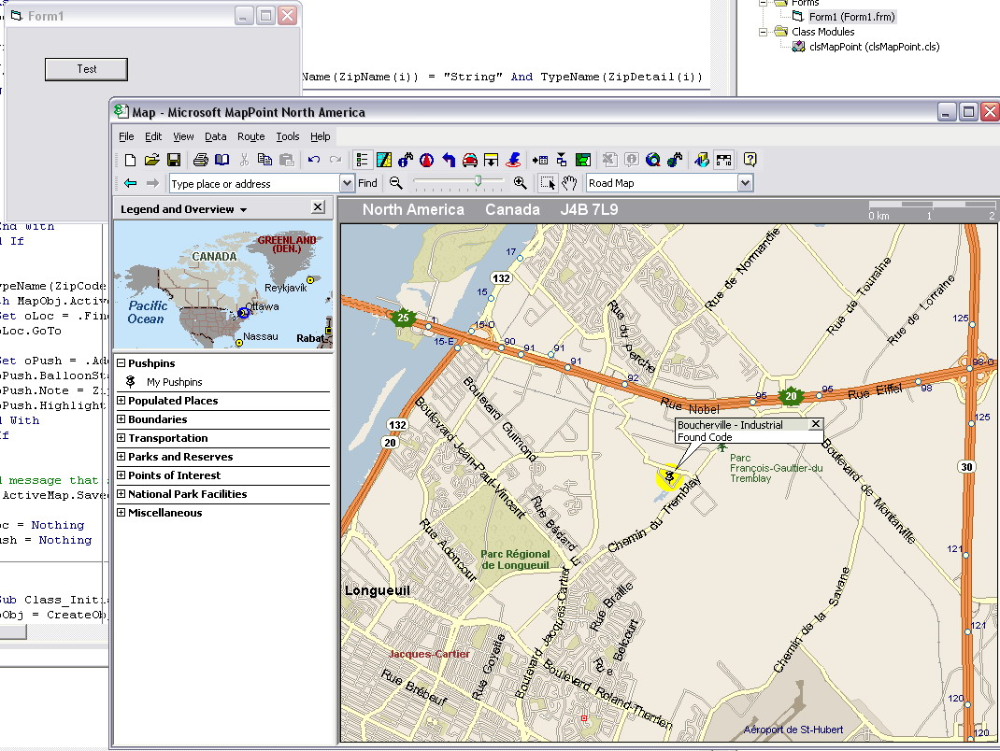



## Find ZipCode using MapPoint \- Version Independant

### Description

Use MapPoint the easy way - Dependency Free

I needed some code to have the possibility to show multiple pushpins for helping Sales Rep to find quickly and easy which other clients where in the area where they where going. So instead of finding and displaying the find result box every adress, i only use ZipCode since it will get what I want based on my SQL Db.

The code is dependency Free (Compatible with mostly all MapPoint version). Also i included the code to know if the mappoint objects are avail (on the form load event)
 
### More Info
 
Made to be simple to implement (not so much mappoint functions) so just add the class to any project and follow the code included on form1

No way to keep MapPoint loaded if the objects are unloaded (not as outlook)

             |
---                |---
**Submitted On**   |2007-01-21 14:11:28
**By**             |[Shad4Ever](https://github.com/Planet-Source-Code/PSCIndex/blob/master/ByAuthor/shad4ever.md)
**Level**          |Beginner
**User Rating**    |5.0 (10 globes from 2 users)
**Compatibility**  |VB 5\.0, VB 6\.0
**Category**       |[Microsoft Office Apps/VBA](https://github.com/Planet-Source-Code/PSCIndex/blob/master/ByCategory/microsoft-office-apps-vba__1-42.md)
**World**          |[Visual Basic](https://github.com/Planet-Source-Code/PSCIndex/blob/master/ByWorld/visual-basic.md)
**Archive File**   |[Find\_ZipCo2043921212007\.zip](https://github.com/Planet-Source-Code/shad4ever-find-zipcode-using-mappoint-version-independant__1-67697/archive/master.zip)

